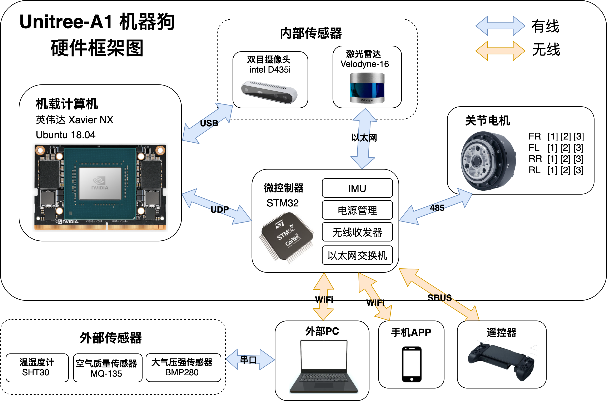
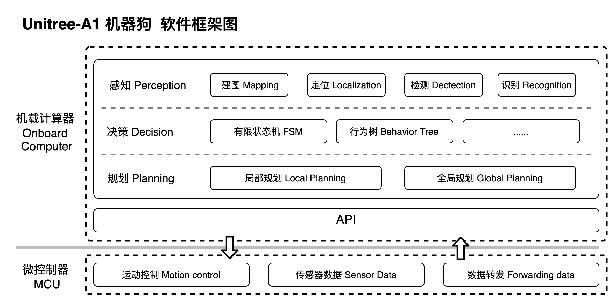

# tsinghua-Unitree-ROS

##  Introduction
[**Unitree A1 Robot dogs**](https://www.unitree.com/cn/products/a1)  

[ROS melodic](http://wiki.ros.org/melodic) + [SLAM](https://github.com/MistyMoonR/tsinghua-SLAM)

### Hardware: 
* Upboard : Z8350 4G Memory  64G Hard Disk  
* Computer : [Jetson Xaiver NX](https://developer.nvidia.com/embedded/jetson-xavier-nx) / NUC8 i7-8650U
* Lidar : [Velodyne-16](data/Velodyne_16.md)
* IMU: [Advanced Navigation Spatial + Tallysman GPS](data/Spatial.md)
* Camera: [intel D435i](data/intel-D435i.md)

### System environment:  
- Ubuntu18.04 LTS
- ROS melodic 1.14.11

----
## Learning materials:

**[An overview of the Robot Operating System(CN)](doc/机器人操作系统（ROS）浅析.pdf)**

## Document description

**Conducted in two lines**
### [ROS Workspace](ROS_ws)

- Lidar: [Velodyne](data/Velodyne_16.md) / [Lslidar](data/lslidar_c16.md)
- 9-axis IMU: [Spatial](data/Spatial.md)
- Binocular camera: [intel D435i](data/intel-D435i.md)

### [A study of SUSTech patroldog_ws](patroldog_ws) (Abandoned)

## Document links

- **[ROS_ws](ROS_ws/README.md)**
- **[Development Environment Installation Steps](Development-environment.md)**     
- [unitree ros Development Notes](Notes.md)     
- [unitree API interface protocols](data/API.md)     
- [Key Functions](data/keyboard.md)     
- [intel D435i camera](data/intel-D435i.md)
- [Velodyne-16-wire LiDAR](data/Velodyne_16.md)    
- [Spatial 9-axis IMU](data/Spatial.md)

---
## Project progress: 
- [x]  Test environment build + compile driver (unitree_ros)
- [x]  Gazebo dynamics simulation for Unitree_ROS (aborted)
- [x]  unitree_legged_sdk API library research (no need to look, based on running on ROS)
- [x]  Research patroldog_ws related code (can run basic functions, need secondary development)
- [x]  Build your own ROS_ws project and improve the documentation
- [x]  TF coordinate transformation 

----
## Picture:

### Hardware architecture diagram

### Software architecture diagram

----

## Hardware related:
### intel D435i 
Github: [librealsense](https://github.com/IntelRealSense/librealsense/releases/tag/v2.45.0)      
ROS: [realsense-ros](https://github.com/IntelRealSense/realsense-ros)

### Velodyne 16 
Github:  [velodyne](https://github.com/ros-drivers/velodyne.git)        
ROS wiki: [Getting Started with the Velodyne VLP16](http://wiki.ros.org/velodyne/Tutorials/Getting%20Started%20with%20the%20Velodyne%20VLP16)

### 9-axis IMU - Spatial:     
Official website: [Spatial](https://www.advancednavigation.com/products/spatial)        
ROS wiki: [advanced_navigation_driver](http://wiki.ros.org/advanced_navigation_driver)   

----
## References: 
     
unitree Technology A1 Product Description:    
https://www.unitree.com/cn/products/a1

A1 ROS related:  
https://github.com/unitreerobotics/unitree_ros      
https://github.com/unitreerobotics/unitree_legged_sdk

C++ Key functions:      
https://www.iteye.com/blog/bingtears-663149

Third party motion control:        
https://github.com/lnotspotl/a1_sim_py 

Google research:        
https://xbpeng.github.io/projects/Robotic_Imitation/index.html      
https://ai.googleblog.com/2020/04/exploring-nature-inspired-robot-agility.html

----