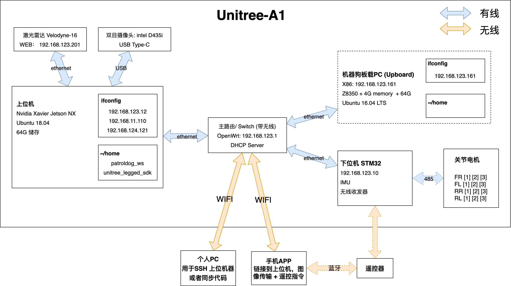

# tsinghua-Unitree-ROS

## 简介
**Unitree A1 机器狗**       
ROS + SLAM

硬件：  
* Upboard : Z8350处理器 4G内存 64G 硬盘   
* 上位机 : Jetson Xaiver NX / NUC8 i7-8650U
* 激光雷达 : Velodyne-16

系统环境： 
- Ubuntu18.04 LTS
- ROS melodic 1.14.11

----
## 文档说明

**分两条线路进行**

- [南科大patroldog_ws的研究](/patroldog_ws)

- [构建自己的ROS工作空间](/ROS_ws)

## 文档链接

[开发环境 安装 步骤](/Development-environment.md)     

[unitree ros 开发笔记](/Notes.md)     

[unitree API接口协议](/data/API.md)     

[键位函数](/data/keyboard.md)     

[Velodyne-16线激光雷达](/data/A1-velodyne16.md)     

---
## 项目进度：
- [x]  测试环境搭建 + 编译驱动和依懒包(unitree_ros)
- [x]  Unitree_ROS 的 Gazebo 动力学仿真(中止)
- [x]  unitree_legged_sdk API库研究(不用看，基于ROS上运行)
- [ ]  LIO-SAM开源的SLAM建模
- [ ]  研究patroldog_ws 相关代码(能运行基本功能，需二次开发)
- [ ]  构建自己的ROS_ws项目，完善文档

----
## 架构图

----
## 引用：
     
宇树科技 A1 产品介绍：  
https://www.unitree.com/cn/products/a1

A1 ROS相关：  
https://github.com/unitreerobotics/unitree_ros      
https://github.com/unitreerobotics/unitree_legged_sdk

SLAM相关：  
https://github.com/TixiaoShan/LIO-SAM       
https://github.com/borglab/gtsam/releases   

intel D435i 双目摄像头相关(由于玄学问题，需要降级到v2.45.0版本):        
https://github.com/IntelRealSense/librealsense/releases/tag/v2.45.0     
https://github.com/IntelRealSense/realsense-ros

Velodyne 16线激光雷达:      
https://github.com/ros-drivers/velodyne.git    
http://wiki.ros.org/velodyne/Tutorials/Getting%20Started%20with%20the%20Velodyne%20VLP16         

C++ 键位函数：      
https://www.iteye.com/blog/bingtears-663149

第三方运动控制：        
https://github.com/lnotspotl/a1_sim_py 

Google research:        
https://xbpeng.github.io/projects/Robotic_Imitation/index.html      
https://ai.googleblog.com/2020/04/exploring-nature-inspired-robot-agility.html