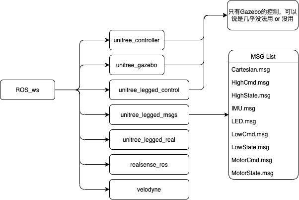

# ROS_ws 构建过程

系统环境： 
- Ubuntu18.04 LTS
- ROS melodic 1.14.11
- Unitree_Ros change to ROS_ws

目录： 
* 
* 
* unitree_legged_real

问题：
- [x]        

----

# 基于宇树科技的unitree_ros构建一个工作空间
## 

基本思路： 下载unitree_ros然后编译，注意 ~/.bashrc文件      
然后装入相机ROS： https://github.com/IntelRealSense/realsense-ros       

激光雷达ROS：
https://github.com/ros-drivers/velodyne.git

说明文档： http://wiki.ros.org/velodyne/Tutorials/Getting%20Started%20with%20the%20Velodyne%20VLP16
## 
  

----

## 

----

## 

----

# 

----

----

SLAM相关：      
https://github.com/TixiaoShan/LIO-SAM   
https://github.com/borglab/gtsam/releases

宇树科技相关：      
https://github.com/unitreerobotics/unitree_ros

C++ 键位：       
https://blog.csdn.net/zjsxxzh/article/details/50662833