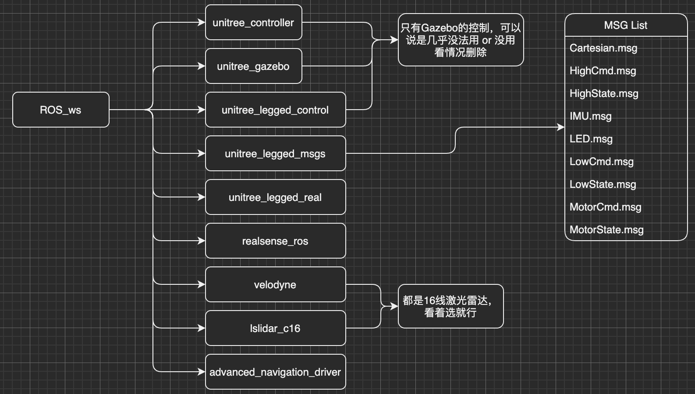
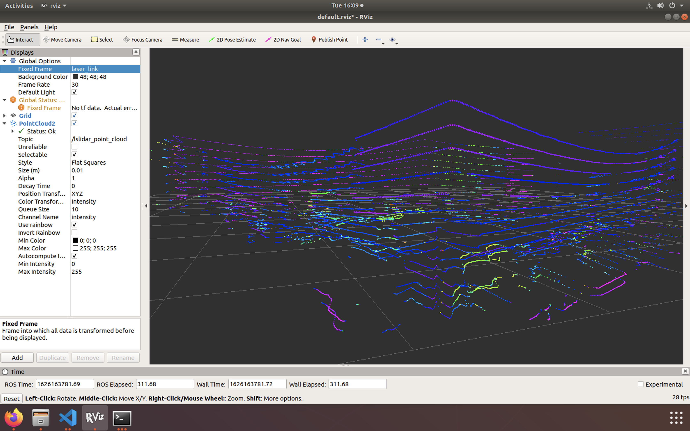
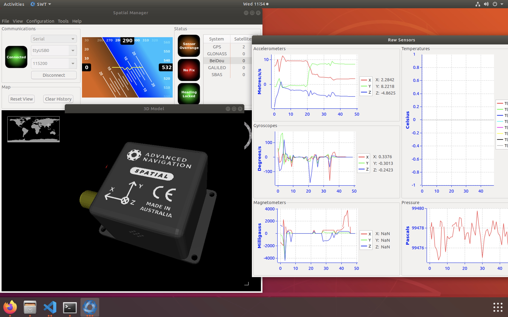

# ROS_ws 构建过程

**[Releases版本](code/Releases.md)**

系统环境： 
- Ubuntu18.04 LTS
- ROS melodic 1.14.11
- Unitree_Ros change to ROS_ws

硬件：
- NUC8 i7-8650U
----

目录： 
* unitree_ros     
* realsense_ros
* velodyne
* lslidar_c16
* advanced_navigation_driver


问题：
- [x]  使用镭神激光雷达需要把本机IP地址改成192.168.1.102 (很不喜欢这一设定) , 而且 扫描图像可能有问题。    
- [ ] Spatial 九轴陀螺仪有ROS包，官方(MIT)提供的包发现CPU占用过高，Github上有另外fork，但是放到ROS_ws编译不通过，先放着

## 系统框架图


----

## 基于宇树科技的unitree_ros构建一个工作空间

基本思路： 下载`unitree_ros`然后编译，注意 `~/.bashrc`文件      
然后装入相机ROS： https://github.com/IntelRealSense/realsense-ros       

激光雷达ROS：
https://github.com/ros-drivers/velodyne.git

说明文档： http://wiki.ros.org/velodyne/Tutorials/Getting%20Started%20with%20the%20Velodyne%20VLP16
## 
  
----

## 首先需要安装环境 (重要)

[开发环境 安装 步骤](/Development-environment.md) 

----

## 镭神激光雷达包
来源： https://github.com/tianb03/lslidar_c16

测试：  

``` r
roslaunch lslidar_c16_decoder lslidar_c16.launch --screen    
```
需要把 `Global Options` 中修改为 `/laser_link`



----

## 九轴IMU - Spatial :  
来源：https://www.advancednavigation.com/products/spatial 

ROS:         
http://wiki.ros.org/advanced_navigation_driver  (CPU占用过高)  
https://github.com/kylerlaird/advanced_navigation_driver (编译不通过)  

测试: 
``` r
rosrun advanced_navigation_driver advanced_navigation_driver
``` 
[Advanced Navigation ROS Driver Notes.txt](code/ROS_ws/src/unitree_ros/advanced_navigation_driver/Advanced-Navigation-ROS-Driver-Notes.txt) 在 `/ROS_ws/src/unitree_ros/advanced_navigation_driver` 里面有详细介绍


**Advanced Navigation 提供的JAR工具包**
``` r
sudo java -jar SpatialManager-5.8.jar 
``` 


----


