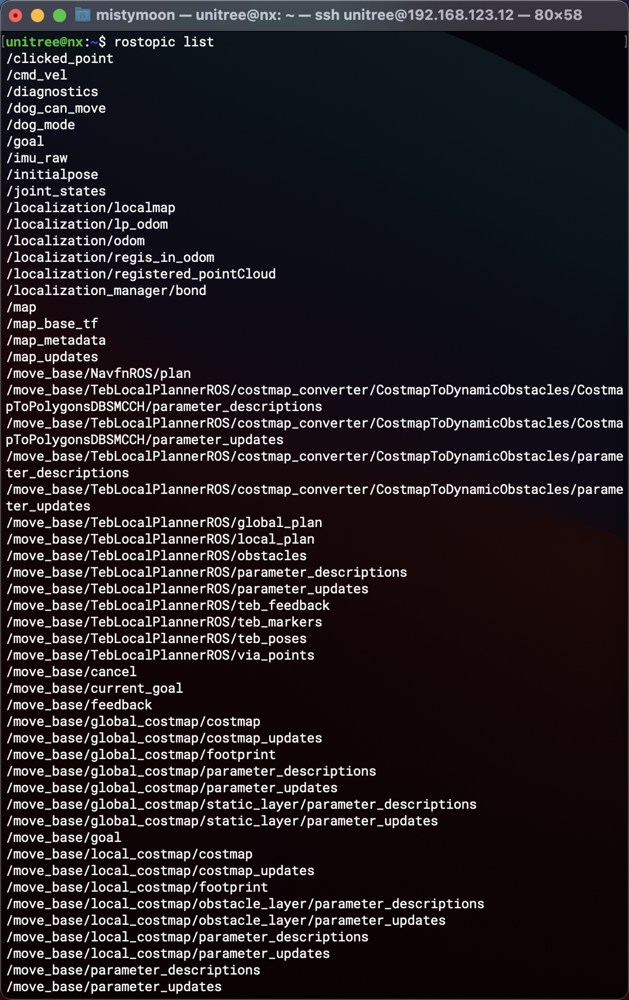

# tsinghua-Unitree-ROS

系统环境： 
- Ubuntu18.04 LTS
- ROS melodic 1.14.11
- Unitree_Ros change to patroldog_ws

目录： 
* start
* nvigation
* unitree_legged_real

问题：
- [x]   GTSAM 依懒安装 详见 LIO-SAM 的文档，否则直接跑不了(lboost::xxx)     


结构： 
* gmapping  SLAM扫描地图底层算法
* lio_sam  开源SLAM算法
* navigation launch包，包含 机器狗控制指令和 2D地图通航指令
* ndt_localization  貌似是关于voxel点云算法（激光雷达用
    * ndt_omp
    * prm_localization
* start  初始化路径 **
* unitree_legged_msgs  宇树科技 信息包
* unitree_legged_real  ROS里面控制物理狗 
* velodyne  16线激光雷达驱动包 


----

**`rostopic list`**



# start 篇
## 建图任务 ： `build_map.launch`       

启动激光雷达:   
```
$(find velodyne_pointcloud)/launch/VLP16_points.launch
```    
3D SLAM 建图算法 lio-sam: 
```  
$(find lio_sam)/launch/run.launch
```     
base_link到base_footprint的坐标变换:   
``` xml
<node pkg="tf" type="static_transform_publisher" name="base_footprint_broadcaster" args="0 0 0 0 0 0 /base_link /base_footprint 100"/>
```
2D SLAM算法 gmapping (二维建图，RVIZ可视化): 
```xml
<node pkg="gmapping" type="slam_gmapping" name="slam_gmapping_node" output="screen">
        <param name="map_frame" value="map"/>
        <param name="base_frame" value="base_link"/>
        <param name="delta" value="0.1"/>   #地图的分辨率
        <param name="map_file_path" value="$(find start)/maps/gmapping/$(arg map_name)"/>
</node>  
```  
map  到 local_map的坐标变换:
``` xml
 <!-- <node pkg="start" type="local_map_tf_publisher" name="local_map_tf_publisher_node" output="screen"/> -->   
```
启动路径规划和避障的算法:
``` xml
 <include file="$(find navigation)/launch/move_base.launch">
    <arg name="odom_topic" value="/lio_sam/mapping/odom"/>
</include>
```    
启动与机器狗的通讯:     
``` xml
<include file="$(find unitree_legged_real)/launch/real.launch"/> 
```    
与机器狗沟通的 ROS 界面:     
``` xml
    <node pkg="unitree_legged_real" type="ros_control" name="dog_control_node" output="screen">
        <param name="is_build_map" value="true"/>
        <param name="patrol_points_file" value="$(find start)/maps/gmapping/$(arg map_name)_patrol_points.txt"/>
    </node>
```    
## 巡逻任务 ： `start_patrol.launch`               
   
-  启动导航路径规划，避障的算法(和上面有略不同): 
```    xml 
<include file="$(find navigation)/launch/navigation.launch">
    <arg name="map_file" value="$(find start)/maps/gmapping/$(arg map_name).yaml"/>
    <arg name="odom_topic" value="/localization/odom"/>
</include>
```    

- 启动巡逻点的发布程序: 
```   xml
<node pkg="start" type="patrol" name="send_patrol_points" output="screen">
    <param name="patrol_points_file" value="$(find start)/maps/gmapping/$(arg map_name)_patrol_points.txt"/>
</node>
```   

----
# nvigation篇

Tips:   
查看ROS Graph：`rqt_graph`     

## **Gazebo 动力学仿真**  

Gazebo没高层运动控制

/unitree_ros/unitree_gaebo/launch/normal.launch 头部可以更改default="a1"

运行部分： 
``` 
roslaunch unitree_gazebo normal.launch 

##下面新开两个终端分别运行
rosrun unitree_controller unitree_servo
rosrun unitree_controller unitree_move_kinetic  #camkelist里面没改，也不影响
``` 

Gazebo本质上是调用a1_description的urdf文件      

[教程：在 Gazebo 中使用 URDF](http://gazebosim.org/tutorials/?tut=ros_urdf)

unitree_controller文件夹里面的CmakeLists.txt
----

## **Rviz 可视化** 

``` 
# 运行launch 需要连接机器人才行 没测试过
roslaunch a1_description a1_rviz.launch
```    

----

## **LCM - UDP 数据通信** 

机器狗用于 LCM Server 传输消息, LCM Channel实现

LCM转UDP向下发送，UDP转LCM向上发送。 

并非采用ROS Subscriber/Publisher的方式来传递数据(实时性没保障)

UDP Multicast Setup : https://lcm-proj.github.io/multicast_setup.html

----

# LIO-SAM SLAM建模
LIO-SAM
需要一个IMU传感器，最好是9轴IMU


----
实物机器狗

参数设置：
patroldog_ws/src/navigation/param/teb_local_planner_params.yaml

----

SLAM相关：      
https://github.com/TixiaoShan/LIO-SAM   
https://github.com/borglab/gtsam/releases

宇树科技相关：      
https://github.com/unitreerobotics/unitree_ros

C++ 键位：       
https://blog.csdn.net/zjsxxzh/article/details/50662833